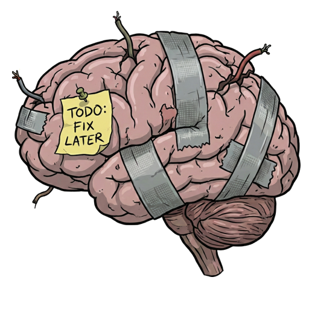

# Hivemind

A collaborative knowledge management system for Discord communities.

## What is Hivemind?

Hivemind enables Discord guild members to build and maintain shared knowledge bases directly within Discord. It provides three core content types:

- **Wikis** - Collaborative articles on any topic, viewable and editable by all guild members
- **Notes** - Personal notes with message references (viewable only be the creator)
- **Quotes** - Memorable messages saved for easy retrieval, viewable by all guild members

## Architecture

Hivemind consists of three components:

- **gRPC Server** - Backend API and data persistence layer
- **Discord Bot** - Slash commands and context menu actions for Discord
- **Web Interface** - Browser-based editing and viewing

## Quick Start

See component-specific documentation:
- [Bot Setup](bot/README.md)
- [Server Setup](server/README.md)
- [Web Setup](web/README.md)

## Features

- Full-text search across all content types
- Message references linking Discord messages to knowledge base entries
- Tag-based organization
- Discord OAuth authentication
- Role-based access control
- Hybrid search with vector embeddings (using Postgres built-in capabilities)

## License

See [LICENSE](LICENSE) file for details.
